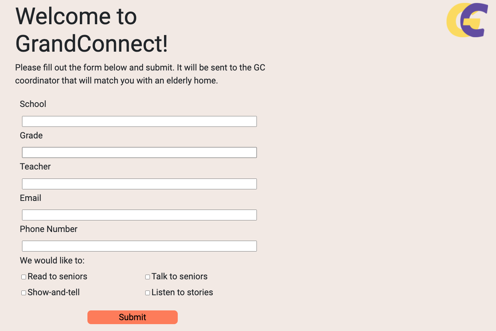
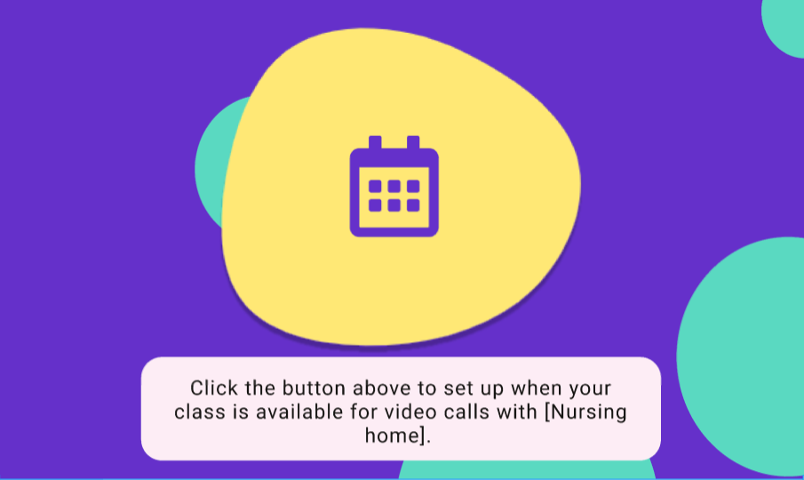

# GrandConnect

GrandConnect was created to connect elementary school children and senior citizens in nursing homes to create a community of empowerment and communication. 
* Teachers at elementary schools and activity coordinators at nursing homes will be able to sign up for an account, and then be matched to each other by a coordinator who receives the forms. This means that an elementary school class will have an assigned nursing home, and thus have “Class Grandparents”.
* After they have signed up and been approved, they will be able to sign in and the teacher/children will get access to a calendar to add their availability for video calls. The nursing home/seniors will have access to the calendar to see availability and schedule video calls based on that.

[See GrandConnect live!](https://caitlinw29.github.io/GrandConnect/)

## User Story

```md
As a teacher, I want the opportunity for my students to adopt a "class grandparent", so that they have new learning opportunities from another generation. 
 ```

 ```md
 As an activity coordinator at an aged care facility, I want to schedule chats between a school and my residents, so that the residents have social interactions and new connections.
 ```

## Tools

  Our team designed and built this application using HTML, CSS, JavaScript, BootStrap, Calendly, and Zoom. The wireframe was created using Figma

## Screenshots







## Usage

 This is a web-based application that will run in any browser! Simply visit the link.

## Contribution

[Caitlin Wall](https://github.com/caitlinw29), [Christian Sanchez ](https://github.com/CSanchez486), [Akeia M.](https://github.com/DrMcCollum5), and [Johanna Berntsson ](https://github.com/johbern)

## Presentation

* [Video Presentation]()

## Deployed Link

* [See GrandConnect live!](https://caitlinw29.github.io/GrandConnect/)

#### Thank you for checking out our project!
